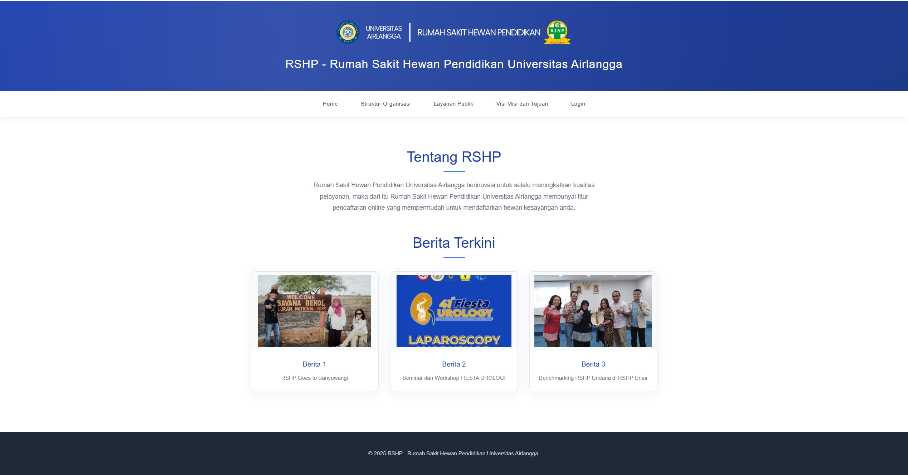
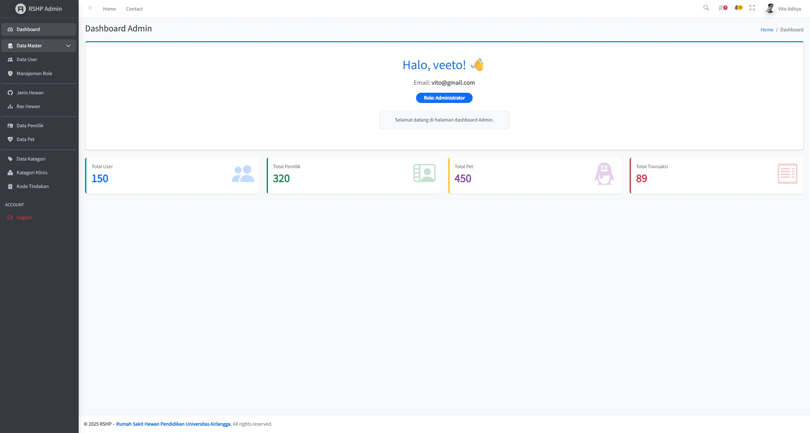
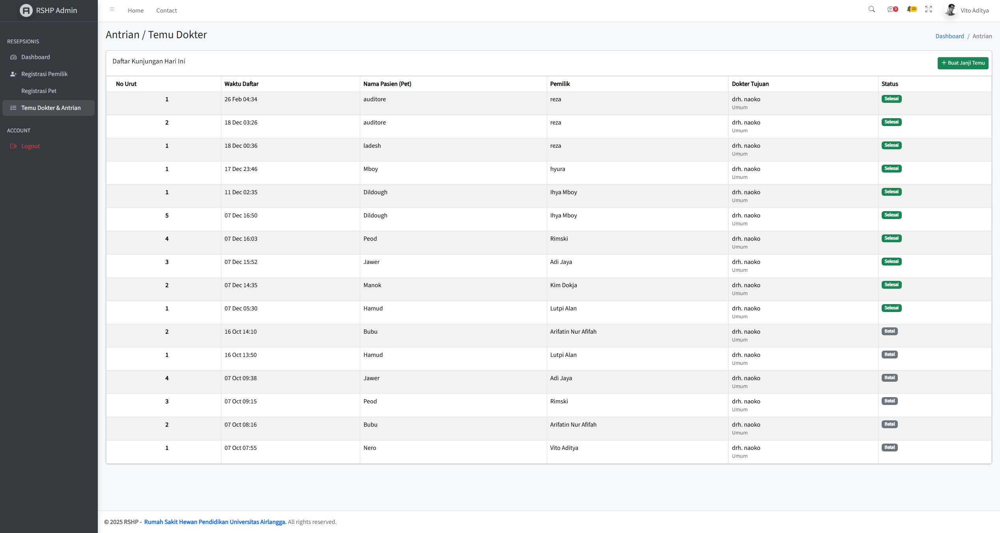
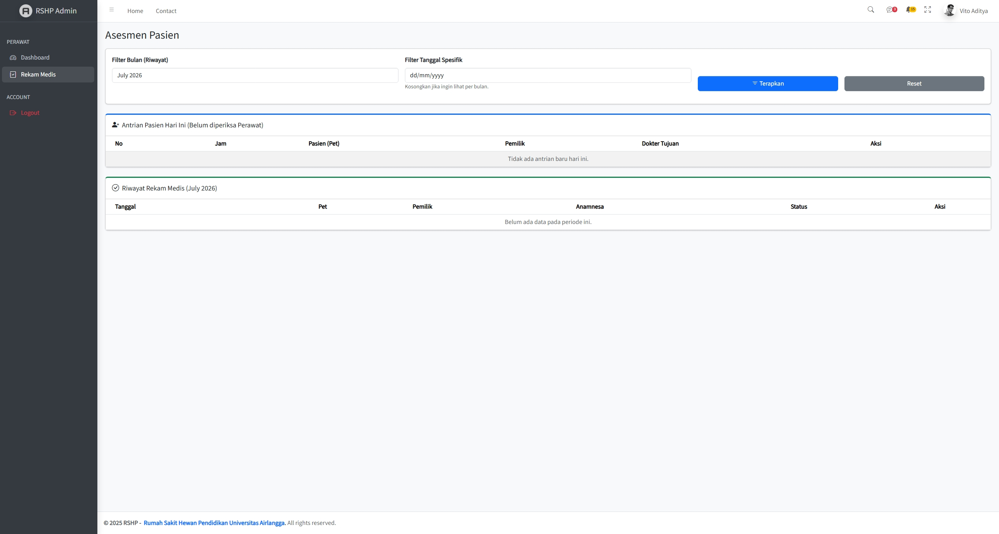
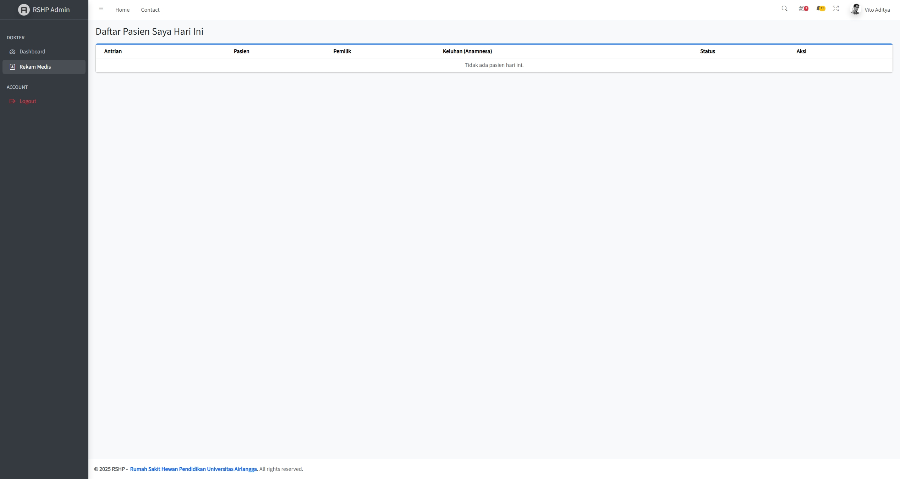
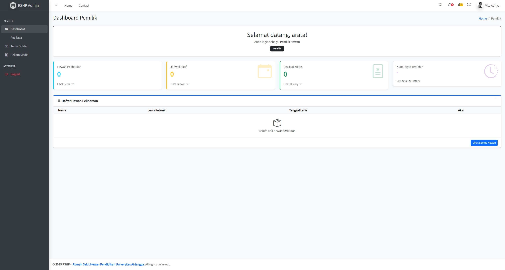

<div align="center">

 

<br/><br/>

# RSHP — Rumah Sakit Hewan Pendidikan Universitas Airlangga

Aplikasi web untuk mengelola alur pelayanan klinik hewan secara digital, mulai dari pendaftaran pasien, asesmen perawat, pemeriksaan dokter, hingga rekam medis yang bisa diakses langsung oleh pemilik hewan.

<br/>

[](https://laravel.com)
[](https://php.net)
[](https://mysql.com)
[](LICENSE)

<sub>Tugas Akhir Mata Kuliah Pengembangan Perangkat Lunak Web (Framework)</sub>

</div>

## Tentang Proyek

RSHP adalah aplikasi web untuk mengelola seluruh alur pelayanan rumah sakit hewan pendidikan secara digital. Sistem ini menggunakan **Role-Based Access Control (RBAC)** sehingga setiap pengguna hanya bisa mengakses bagian yang sesuai dengan perannya.

| Role | Akses Utama |
|------|-------------|
| **Administrator** | Mengelola seluruh data master sistem (user, role, jenis hewan, ras, kategori tindakan) |
| **Resepsionis** | Mendaftarkan pemilik dan hewan baru, mengelola antrian kunjungan |
| **Perawat** | Melakukan asesmen awal dan membuat rekam medis pasien hewan |
| **Dokter** | Memeriksa pasien, mengisi diagnosis, merencanakan tindakan terapi |
| **Pemilik Hewan** | Booking kunjungan secara mandiri dan melihat riwayat medis hewan |

## Teknologi

Dibangun menggunakan **Laravel 11** dengan **PHP 8.2+**, database **MySQL**, dan **Blade** sebagai template engine. Autentikasi menggunakan session-based custom auth tanpa package tambahan.

## Fitur per Role

<details>
<summary><strong>Administrator</strong></summary>
<br/>

- CRUD Data User dan Role
- CRUD Jenis Hewan dan Ras Hewan
- CRUD Kategori Layanan dan Kategori Klinis
- CRUD Master Kode Tindakan Terapi
- Pemantauan data Pemilik dan Pet terdaftar
- Dashboard statistik sistem (total user, pemilik, pet, transaksi)

</details>

<details>
<summary><strong>Resepsionis</strong></summary>
<br/>

- Registrasi pemilik hewan beserta pembuatan akun login otomatis
- Registrasi hewan peliharaan (jenis, ras, identitas fisik)
- Pembuatan jadwal antrian temu dokter dengan nomor urut otomatis per hari
- Pemantauan status seluruh antrian kunjungan

</details>

<details>
<summary><strong>Perawat</strong></summary>
<br/>

- Melihat antrian pasien hari ini yang belum diasesmen
- Membuat rekam medis berupa Anamnesa dan Temuan Klinis
- Edit asesmen selama dokter belum mengisi tindakan
- Riwayat rekam medis dengan filter bulan dan tanggal spesifik
- Hapus rekam medis (hanya jika belum ada tindakan dari dokter)

</details>

<details>
<summary><strong>Dokter</strong></summary>
<br/>

- Melihat daftar pasien hari ini yang sudah diasesmen perawat
- Review anamnesa dan temuan klinis dari perawat
- Input diagnosis dan temuan klinis dokter
- Tambah, edit, dan hapus tindakan atau terapi dari master Kode Tindakan
- Input instruksi detail pelaksanaan tindakan
- Tandai pemeriksaan **Selesai** (diagnosis wajib terisi)

</details>

<details>
<summary><strong>Pemilik Hewan</strong></summary>
<br/>

- Lihat daftar dan detail hewan peliharaan milik sendiri
- Booking jadwal temu dokter secara mandiri
- Batalkan kunjungan yang masih berstatus Menunggu
- Riwayat rekam medis lengkap: diagnosa, tindakan, nama dokter (read-only)

</details>

## Alur Penggunaan

1. Resepsionis mendaftarkan pemilik hewan beserta akun loginnya, lalu mendaftarkan hewan peliharaannya
2. Jadwal kunjungan dibuat oleh resepsionis atau langsung oleh pemilik hewan lewat portal mereka
3. Perawat mengisi asesmen awal (anamnesa dan temuan klinis) untuk setiap pasien yang datang
4. Dokter melakukan pemeriksaan, mengisi diagnosis dan rencana tindakan, lalu menyelesaikan kunjungan
5. Pemilik hewan bisa melihat hasil pemeriksaan kapan saja lewat portalnya

Status kunjungan di sistem ada tiga: **Menunggu** saat jadwal baru dibuat, **Selesai** setelah dokter menyelesaikan pemeriksaan, dan **Batal** jika pemilik membatalkan jadwal.

## Tampilan Aplikasi

<div align="center">

<br/><sub>Halaman Publik</sub>
</div>

<br/>

<table>
  <tr>
    <td align="center" width="50%">
      
      <sub>Dashboard Administrator</sub>
    </td>
    <td align="center" width="50%">
      
      <sub>Antrian Temu Dokter (Resepsionis)</sub>
    </td>
  </tr>
  <tr>
    <td align="center" width="50%">
      
      <sub>Asesmen Pasien (Perawat)</sub>
    </td>
    <td align="center" width="50%">
      
      <sub>Daftar Pasien Hari Ini (Dokter)</sub>
    </td>
  </tr>
  <tr>
    <td align="center" width="50%">
      
      <sub>Dashboard Pemilik Hewan</sub>
    </td>
    <td></td>
  </tr>
</table>

## Skema Database

```
user ──── role_user ──── role
 │
pemilik
 │
pet ──── ras_hewan ──── jenis_hewan
 │
temu_dokter ──── role_user [Dokter]
 │
rekam_medis
 │
detail_rekam_medis ──── kode_tindakan_terapi ──── kategori
                                              └─── kategori_klinis
```

| Tabel | Fungsi |
|-------|--------|
| `user` | Akun login semua pengguna |
| `role` dan `role_user` | Mapping user ke role |
| `pemilik` | Data pemilik hewan (alamat, no. WA) |
| `jenis_hewan` dan `ras_hewan` | Master jenis dan ras hewan |
| `pet` | Data hewan peliharaan |
| `temu_dokter` | Jadwal dan antrian kunjungan |
| `rekam_medis` | Header rekam medis (anamnesa, diagnosa) |
| `detail_rekam_medis` | Baris tindakan atau obat per rekam medis |
| `kode_tindakan_terapi` | Master kode tindakan dan terapi |
| `kategori` dan `kategori_klinis` | Klasifikasi tindakan |

## Cara Menjalankan

Pastikan sudah menginstal PHP 8.2+, Composer, MySQL, dan Node.js.

```bash
git clone https://github.com/viesloxy/rshp_project.git
cd rshp_project

composer install
npm install && npm run build

cp .env.example .env
php artisan key:generate
```

Buka file `.env` dan sesuaikan konfigurasi database:

```env
DB_DATABASE=rshp
DB_USERNAME=root
DB_PASSWORD=
```

```bash
php artisan migrate
php artisan serve
```

Buka `http://localhost:8000` di browser.

## Akun Demo

| Peran | Email | Password |
|-------|-------|----------|
| Administrator | vito@gmail.com | vito123 |
| Resepsionis | loxy@gmail.com | loxy123 |
| Perawat | vies@gmail.com | vies123 |
| Dokter | naoko@gmail.com | naoko123 |
| Pemilik Hewan | arata@gmail.com | arata123 |

<br/>

<div align="center">
<sub>Dibangun dengan Laravel · Universitas Airlangga · 2025</sub>
</div>
